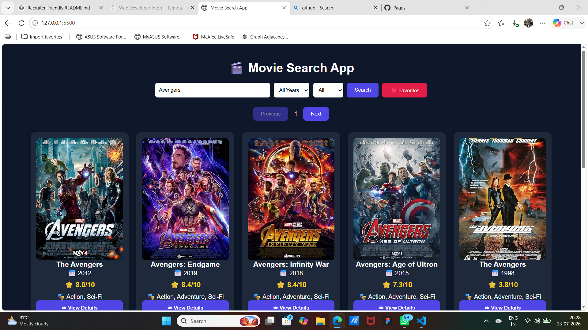
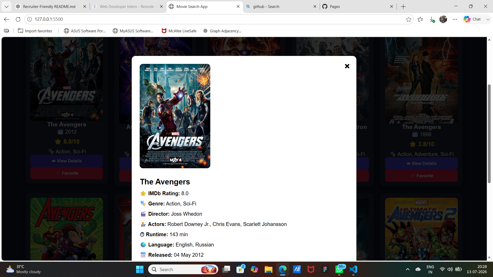

# 🎬 Movie Search App

A responsive and interactive movie search application built with **HTML5, CSS3, and JavaScript (ES6)** using the **OMDb API**. Users can search movies, filter results, view detailed information, save favorites locally, and browse results with pagination.

---

## 🚀 Live Demo

🔗 **Live Website:** *(Add your GitHub Pages live link here after deployment)*

Example:

```
https://rishikaraj20050-ctrl.github.io/movie-search-app/
```

---

## 📌 Features

* 🔍 Search movies by title
* 📅 Filter movies by release year
* 🎭 Filter by movie type (Movie, Series, Episode)
* 📖 View movie details in a modal popup
* ❤️ Save favorite movies using Local Storage
* 📄 Pagination for browsing multiple pages
* 📱 Fully responsive design for desktop, tablet, and mobile
* ⚡ Fast and user-friendly interface

---

## 🛠 Tech Stack

* HTML5
* CSS3
* JavaScript (ES6)
* OMDb API
* Git
* GitHub
* GitHub Pages

---

## 📂 Project Structure

```text
movie-search-app/
│
├── index.html
├── style.css
├── script.js
├── assets/
│   └── images/
├── README.md
└── LICENSE
```

---

## ⚙️ Installation

1. Clone the repository

```bash
git clone https://github.com/rishikaraj20050-ctrl/movie-search-app.git
```

2. Open the project folder

```bash
cd movie-search-app
```

3. Open `index.html` in your browser.

---

## 🔑 OMDb API Setup

1. Get a free API key from **https://www.omdbapi.com/apikey.aspx**

2. Replace your API key in `script.js`

```javascript
const API_KEY = "YOUR_API_KEY";
```

---

## 📸 Screenshots

### Home Page



### Movie Details




---

## 🎯 Future Improvements

* User authentication
* Dark Mode
* Trending Movies section
* Search Suggestions
* Voice Search
* Watchlist synchronization
* Infinite Scrolling
* Genre Filter

---

## 🌐 Deployment

This project is deployed using **GitHub Pages**.

---

## 🤝 Contributing

Contributions are welcome.

1. Fork the repository.
2. Create a new branch.

```bash
git checkout -b feature-name
```

3. Commit your changes.

```bash
git commit -m "Add new feature"
```

4. Push your branch.

```bash
git push origin feature-name
```

5. Create a Pull Request.

---

## 👩‍💻 Author

**Rishika Raj**

GitHub: https://github.com/rishikaraj20050-ctrl

---

## 📄 License

This project is licensed under the MIT License.
